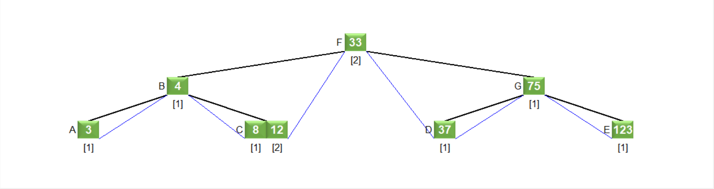
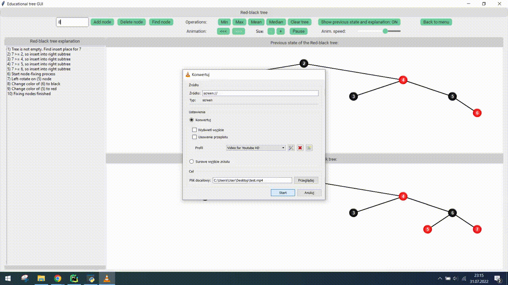
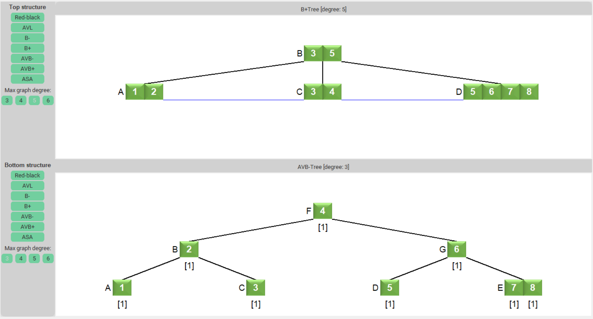

# Educational-tree-GUI

## Quickstart

```bash
# clone this repository
$ git clone https://github.com/MarcinKozak005/Educational-tree-GUI.git
# Install requirements
$ pip install -r requirements.txt
# Run the app
$ python -m core.app
```


## Overview




Educational-tree-GUI is a master thesis project which purpose is:

> The purpose of the thesis is to implement an **interactive GUI, capable of showing an animated presentation** of a
> given operations:
> 1. insertion,
> 2. deletion,
> 3. search,
> 4. finding minimum and maximum values,
> 5. counting mean and median
>
> in:
> 1. ASA-graphs,
> 2. AVB+trees,
> 3. AVB-trees,
> 4. AVL trees,
> 5. red-black trees,
> 6. B+trees,
> 7. and B-trees
>
> to educationally present how these operations work, including intermediate steps. The scope of the thesis includes
> implementing the structures with a unified GUI, **with the possibility of observing operations and comparing them for
two selected trees**.

In addition to the above-mentioned functionalities, the app can also:

1. increase/decrease the size of the drawn nodes,
2. change the speed of the animation,
3. browse the previous states of the structure

## Examples

Red-black tree insertion and rotation:



ASA-Graph insertion (YouTube video link):

[](https://youtu.be/Ys_sKTD7Xjo)


Comparison of two structures:


The master thesis (in English) with detailed description of the theory and the implementation nuances can be
found [here](https://drive.google.com/file/d/15Wfne6ng9l77Lf0h-j7O_O7oFMmrfEi4/view?usp=sharing).